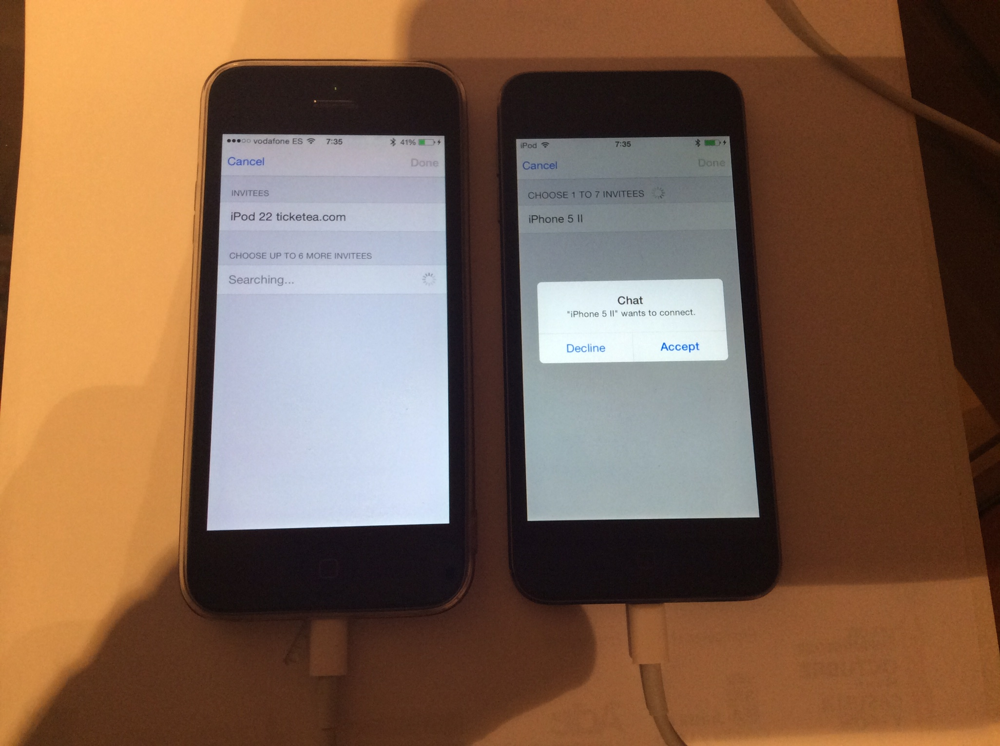
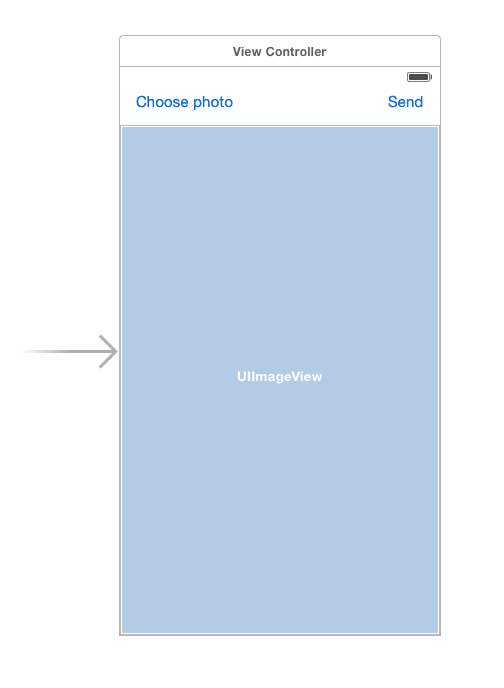

# [fit]Synchronizing
# [fit]_without_ internet

## __Codemotion 2014__, Madrid

---

## [fit]Who am I?


### Jorge Maroto __(@patoroco)__<br/>__[http://maroto.me](http://maroto.me)__

- iOS Developer __@ticketeaeng__
- Playing with iOS since 2010
- Fanboy

---

# [fit]__*Synchronize*__


^ DRAE: "Hacer que coincidan en el tiempo dos o más movimientos o fenómenos."

^ Cuando hablamos de sincronizar ordenadores o dispositivos móviles en general, de algún modo estamos pensando en tener la misma información en nuestro ordenador y en nuestro tablet por ejemplo.

---


^ De hecho, existen numerosos servicios en internet que nos permiten compartir archivos de forma practicamente transparente para nosotros, y que mágicamente harán que por ejemplo una imagen que hagamos con nuestro iPhone, aparezca de manera casi inmediata en nuestro Apple TV.

---


^ Otro buen ejemplo de cómo compartir información entre distintos dispositivos, son los juegos multiplayer...

---


^ Lo más común para este tipo de situaciones es disponer de un servidor centralizado en la famosa nube, al cual se conectan todos los dispositivos que quieran compartir esta información.

---

## [fit]__¿Internet?__


^ Todo esto va bien mientras tengamos internet, pero qué ocurre si estamos en mitad del campo y queremos compartir un archivo o simplemente jugar una partida con los amigos?

---


## [fit]__LAN (wired / wi-fi)__

^ La solución es evidente: crear nuestra propia infraestructura, bien cableada o bien por wifi, pero no deja de ser un engorro el tema de configurar 

---


# [fit]What about iOS?

^ Afortunadamente Apple lleva varios años tratando de ponernoslo fácil a los desarrolladores

---

##  Changelog

- iOS 3: Game Kit
- iOS 4: Game Center
- iOS 5: Core Bluetooth
- iOS 6: Core Bluetooth advertising
- iOS 7: Multipeer Connectivity & iBeacons
- iOS 8: Handoff

^ Game Center permite jugar contra otras personas en cualquier lugar del mundo a través de sus servicios.

^ Core Bluetooth was introduced for the first time in iOS 5 to allow iOS devices to consume data provided by devices used in healthcare, sport/fitness, security, automation, entertainment, proximity and so on. In iOS 6.0, this API was extended to allow also iOS devices to serve data.

^ The Core Bluetooth API is based on the Bluetooth 4.0 Low Energy (LE) specifications. This framework takes care of all the details of the Bluetooth LE standard. However, it is designed to provide developers with the necessary level of control.

^ Only the latest iOS devices and Macs are compliant with the Bluetooth LE specifications: iPhone 4S, iPhone 5, Mac Mini, the New iPad, MacBook Air, MacBook Pro. Additionally, the iOS 6 iPhone Simulator supports the same standard. This is really useful during the development of your app, because it allows you to test it against the iPhone Simulator with no need to have an extra device.

---

##  Changelog

- iOS 3: Game Kit
- iOS 4: Game Center
- iOS 5: Core Bluetooth
- iOS 6: Core Bluetooth advertising
- iOS 7: **Multipeer Connectivity** & iBeacons
- iOS 8: **Handoff**

^ Las marcadas son las que sirven en entornos locales, sin requerir internet.

^ En iOS 8 y yosemite permite Airdrop conjunto.

---

## [fit]**Multi_peer_**
## [fit]**_Connect_ivity**

^ Facilita el descubrimiento y la comunicación con dispositivos cercanos.

^ Multipeer para Mac comparte API con iOS.

^ Las diferencias básicas son que en iOS solo se permite actuar en foreground y mac permite background, y también que Mac solo soporta wifi y no bluetooth a través de su API de AirDrop.

---

## Multipeer connectivity

- Appears in _iOS7_.
- Ability to connect to a mesh of peers.
- Able to connect to peers over _WiFi_, _ad-hoc wireless_, and _Bluetooth_.
- *Doesn't require server infraestructure.*
- Peers must be __'nearby'__.

---


^ Una de las grandes ventajas es que se puede crear una "cadena" de dispositivos, y la información "fluye".
Esto conlleva que todo el tráfico pasa por todos los dispositivos, y puede hacer que no sea la mejor solución para depende qué cosas.

---


^ En yosemiti se permite la conectividad entre dispositivos móviles y ordenadores, y que tiene una versión más "simplificada" que permite continuar con tareas de un dispositivo en otro y así.

---

#[fit]_MultipeerConnectivity.framework_
#[fit]Bonjour _|_ CFNetwork

^ Multipeer connectivity es una abstracción sobre bonjour y CFNetwork

---

# Two phases
- Discovery
- Session

---

# _Classes_ 

```objectivec
#import <MultipeerConnectivity/MultipeerConnectivity.h>
```

## Session info
## Discovery
## Advertisement


---

## [fit]_Session info_

- MCPeerId
- MCSession

---

MCPeerId

```objectivec
MCPeerID *peerId =
 [[MCPeerID alloc] initWithDisplayName:self.deviceName];
```
---
 
MCSession

```objectivec
MCSession *session =
 [[MCSession alloc] initWithPeer:self.peerId];

session.delegate = self;
```

---

__<__MCSessionDelegate__>__

```objectivec
- (void)session:(MCSession *)session
  peer:(MCPeerID *)peerID
  didChangeState:(MCSessionState)state
{
	switch (state):
	{
		case MCSessionStateConnected:
		...
		case MCSessionStateConnecting:
		...
		case MCSessionStateNotConnected:
		...
	}
}
```

---

__<__MCSessionDelegate__>__

```objectivec
// DATA
- (void)session:(MCSession *)session
	didReceiveData:(NSData *)data
	fromPeer:(MCPeerID *)peerID {}

// RESOURCES
- (void)session:(MCSession *)session
	didStartReceivingResourceWithName:(NSString *)resourceName
	fromPeer:(MCPeerID *)peerID
	withProgress:(NSProgress *)progress {}
- (void)session:(MCSession *)session
	didFinishReceivingResourceWithName:(NSString *)resourceName
	fromPeer:(MCPeerID *)peerID atURL:(NSURL *)localURL
	withError:(NSError *)error{}

// STREAMS
- (void)session:(MCSession *)session
	didReceiveStream:(NSInputStream *)stream
	withName:(NSString *)streamName
	fromPeer:(MCPeerID *)peerID{}
```

---

## [fit]_Discovery_

- MCBrowser__ViewController__
- MCNearbyServiceBrowser

^ En la fase de descubrimiento, cada peer actúa como un DNS por si mismo, utilizando URLs con dominio .local.

^ Usa DNS multicast para descubrir nuevos servicios, y los peers auto asignandose una IP en el rango 169.254.x.x.

^ Solo voy a explicar el mcbrowser en esta presentación. El otro es programaticamente, pero hace lo mismo.

---

MCBrowserViewController

```objectivec
NSString * const serviceIdentifier = @"codemotion-demo";

MCBrowserViewController *browser =
	[[MCBrowserViewController alloc] initWithServiceType:serviceIdentifier
	session:self.appdelegate.session];

browser.delegate = self;

[self presentViewController:browser animated:YES completion:nil];
```

^ Se recomienda utilizar un identificador de 1 a 15 caracteres.

---



^ Diálogo que se muestra para elegir los distintos peers

---

__<__MCBrowserViewControllerDelegate__>__

```objectivec
- (void)browserViewControllerDidFinish:(MCBrowserViewController *)b {}

- (void)browserViewControllerWasCancelled:(MCBrowserViewController *)b {}
```

^ Los botones del browser que se muestra como modal

---


## [fit]_Advertisement_

- MCAdvertiser__Assistant__
- MCNearbyServicesAdvertiser

---

MCAdvertiserAssistant

```objectivec
NSString * const serviceIdentifier = @"codemotion-demo";

MCAdvertiserAssistant *advertiser =
 [[MCAdvertiserAssistant alloc]
	initWithServiceType:self.serviceIdentifier
	discoveryInfo:nil session:session];

[advertiser start];
```

^ DiscoveryInfo es un diccionary que puede contener información sobre el peer. El máximo es de 256 bytes entre las claves y valores.

---

#[fit]Session phase

---

## Sending data

- NSData to an **array of peers**.
- NSURL resource to **a peer**.
- NSStream to **a peer**.

^ El delegado MCSessionDelegate está preparado para tres tipos de eventos según sea lo que se reciba.

---

## Send NSData to an array of peers

```objectivec
- (BOOL)sendData:(NSData *)data
	toPeers:(NSArray *)peerIDs
	withMode:(MCSessionSendDataMode)mode
	error:(NSError **)error;
```

## Modes
- MCSessionSendDataReliable
- MCSessionSendDataUnreliable

^ Dos modos: La analogía que se suele utilizar es la de TCP frente a UDP.

^ MCSessionSendDataReliable: The framework should guarantee delivery of each message, enqueueing and retransmitting data as needed, and ensuring in-order delivery.
	This message type should be used for application-critical data.

^ MCSessionSendDataUnreliable: Messages to peers should be sent immediately without socket-level queueing. If a message cannot be sent immediately, it should be dropped. The order of messages is not guaranteed.
	This message type should be used for data that ceases to be relevant if delayed, such as real-time gaming data.

---

## [fit]DEMO
### Hello world in MC


^ Hello world (enviarse un mensaje de uno a otro). Con esto se muestran las ventanas de conexión y demás, y se mandan NSStrings tal cual.

^ Ventajas: se puede enviar a un array de peers facilmente.
  Se recomienda para pequeñas cantidades de información, ya que mete bastante overhead.

---	

## [fit]Video


---


---

### Send resource to a peer

```objectivec
- (NSProgress *)sendResourceAtURL:(NSURL *)resourceURL
	withName:(NSString *)resourceName
	toPeer:(MCPeerID *)peerID
	withCompletionHandler:(void(^)(NSError *error))completionHandler;
```

^ Se puede enviar un archivo referenciado por una NSURL.

^ Devuelve un NSProgress al que se puede observar para representarlo con una barra de progreso por ejemplo.

^ Solo se envía a un peer en concreto, y que si se quiere enviar a todos los conectados, hay que recorrer el array.

---

## [fit]Example
### Share images from photo library


---



```objectivec
@property (weak, nonatomic) IBOutlet UIImageView *picture;
```

---

```objectivec
- (IBAction)choosePhoto:(UIButton *)sender
{
    UIImagePickerController *picker = [[UIImagePickerController alloc] init];
    picker.delegate = self;
    picker.allowsEditing = NO;
    picker.sourceType = UIImagePickerControllerSourceTypePhotoLibrary;
    picker.mediaTypes = @[(NSString *)kUTTypeImage];
    
    [self presentViewController:picker animated:YES completion:nil];
}
````

---

## __<__UIImagePickerDelegate__>__

```objectivec
#pragma mark - UIImagePickerDelegate

- (void)imagePickerController:(UIImagePickerController *)picker
    didFinishPickingMediaWithInfo:(NSDictionary *)info
{
    UIImage *selectedImage = info[UIImagePickerControllerOriginalImage];
    NSData *jpegImg = UIImageJPEGRepresentation(selectedImage, 0.5);
    
    NSString *tmpPath = [NSTemporaryDirectory() stringByAppendingString:@"pic.jpg"];
    self.imageURL = [NSURL fileURLWithPath:tmpPath];
    
    [jpegImg writeToURL:self.imageURL atomically:NO];
    
    self.picture.image = selectedImage;
    [picker dismissViewControllerAnimated:YES completion:nil];
}

- (void)imagePickerControllerDidCancel:(UIImagePickerController *)picker {
    [picker dismissViewControllerAnimated:YES completion:NULL];
}
```

---

## __<__MCSessionDelegate__>__

```objectivec
#pragma mark - 
- (void)session:(MCSession *)session
	didStartReceivingResourceWithName:(NSString *)resourceName
	fromPeer:(MCPeerID *)peerID withProgress:(NSProgress *)progress
{
    dispatch_async(dispatch_get_main_queue(), ^{
        self.picture.image = nil;
        self.picture.backgroundColor = [UIColor yellowColor];
    });
}

- (void)session:(MCSession *)session
	didFinishReceivingResourceWithName:(NSString *)resourceName
	fromPeer:(MCPeerID *)peerID atURL:(NSURL *)localURL
	withError:(NSError *)error
{
	NSData *data = [NSData dataWithContentsOfURL:localURL];
	UIImage *image =
		[[UIImage alloc] initWithData:data];
    
	dispatch_async(dispatch_get_main_queue(), ^{
        self.picture.image = image;
    });
}
```

---

# [fit]Video
### Share images from photo library


---


---

## [fit]Streaming

```objectivec
- (NSOutputStream *)startStreamWithName:(NSString *)streamName
	toPeer:(MCPeerID *)peerID
	error:(NSError **)error;
```

^ Para tareas que requieren mucha velocidad, manejando manualmente el stream se logra evitar el overhead que meten otros métodos como el 
-sendData:toPeers:withMode:error: o -sendResourceAtURL:withName:toPeer:withCompletionHandler:

---

## NSOutputStream: open

```objectivec
- (void)session:(MCSession *)session
	peer:(MCPeerID *)peerID
	didChangeState:(MCSessionState)state
{
	...
	if (state == MCSessionStateConnected)
	{
		NSError *error;
		NSOutputStream *output = 
			[session startStreamWithName:@"streamName" toPeer:peer error:&error];
       
       if (error) { return; }
       
       [output scheduleInRunLoop:[NSRunLoop mainRunLoop] forMode:NSDefaultRunLoopMode];
       [output open];
   }
	...
}
```

^ Se abre un output stream donde escribiremos

---

## NSOutputStream: write

```objectivec
    NSData *data = [NSData data];
    [self.output write:data.bytes maxLength:data.length];
```

---

## NSInputStream

```objectivec
- (void)session:(MCSession *)session
	didReceiveStream:(NSInputStream *)stream
	withName:(NSString *)streamName
	fromPeer:(MCPeerID *)peerID
{
    stream.delegate = self;
    [stream scheduleInRunLoop:[NSRunLoop mainRunLoop]
		forMode:NSDefaultRunLoopMode];
    [stream open];
}
```

^ Al recibir los datos se crea el input stream y se añade al runloop principal

---

## __<__NSStreamDelegate__>__

```objectivec
- (void)stream:(NSStream *)aStream handleEvent:(NSStreamEvent)eventCode
{
	switch (eventCode) {
	case NSStreamEventOpenCompleted:
	...
	case NSStreamEventEndEncountered:
	...
	case NSStreamEventHasBytesAvailable:
	{
       NSInputStream *inputStream = (NSInputStream *)aStream;
       
       uint8_t buffer[1024];
       NSInteger size = [inputStream read:(uint8_t *)buffer maxLength:1024];
       
       NSData *data = [NSData dataWithBytes:buffer length:size];
		...
		// Manage data received
		...       
       break;
	}
	default:
       break;
	}
}
```

---

## [fit]Example
### Shared whiteboard


---


---

## UIPanGestureRecognizer

```objectivec
- (IBAction)panReceived:(UIPanGestureRecognizer *)sender
{
    CGPoint point = [sender locationInView:sender.view];
    
    [self.drawable drawPoint:point state:sender.state];
    
    NSData *data =
		[NSData drawDataWithGestureState:sender.state
		point:[sender locationInView:sender.view]];
    [self.output write:data.bytes maxLength:data.length];
}
```

^ Referenciar a drawpoint que se explica en la siguiente transparencia

^ Pasar a XCode

---

```objectivec
- (void)drawPoint:(CGPoint)point state:(UIGestureRecognizerState)state
{
    switch (state) {
        case UIGestureRecognizerStateBegan:
        {
            lastPoint = point;
            break;
        }
        case UIGestureRecognizerStateChanged:
        {
            CGPoint currentPoint = point;
            
            UIGraphicsBeginImageContext(self.layout.frame.size);
            [self.tmpLayout.image drawInRect:CGRectMake(0, 0, self.layout.frame.size.width, self.layout.frame.size.height)];
            CGContextMoveToPoint(UIGraphicsGetCurrentContext(), lastPoint.x, lastPoint.y);
            CGContextAddLineToPoint(UIGraphicsGetCurrentContext(), currentPoint.x, currentPoint.y);
            CGContextSetLineCap(UIGraphicsGetCurrentContext(), kCGLineCapRound);
            CGContextSetLineWidth(UIGraphicsGetCurrentContext(), 10);
            CGContextSetRGBStrokeColor(UIGraphicsGetCurrentContext(), 0, 0, 0, 1.0);
            CGContextSetBlendMode(UIGraphicsGetCurrentContext(),kCGBlendModeNormal);
            
            CGContextStrokePath(UIGraphicsGetCurrentContext());
            self.tmpLayout.image = UIGraphicsGetImageFromCurrentImageContext();
            [self.tmpLayout setAlpha:1];
            UIGraphicsEndImageContext();
            
            lastPoint = currentPoint;
            break;
        }
        case UIGestureRecognizerStateEnded:
        {
            UIGraphicsBeginImageContext(self.layout.frame.size);
            [self.layout.image drawInRect:CGRectMake(0, 0, self.layout.frame.size.width, self.layout.frame.size.height) blendMode:kCGBlendModeNormal alpha:1.0];
            [self.tmpLayout.image drawInRect:CGRectMake(0, 0, self.layout.frame.size.width, self.layout.frame.size.height) blendMode:kCGBlendModeNormal alpha:1.0];
            self.layout.image = UIGraphicsGetImageFromCurrentImageContext();
            self.tmpLayout.image = nil;
            UIGraphicsEndImageContext();
            break;
        }
            
            
        default:
            break;
    }
}
```

---

```objectivec

- (void)clearScreen
{
    UIGraphicsBeginImageContext(self.layout.frame.size);
    CGContextRef ctx = UIGraphicsGetCurrentContext();
    
    CGContextSetRGBFillColor(ctx, 255.0, 255.0, 255.0, 1.0);
    CGContextFillRect(ctx, CGRectMake(0, 0,
		self.tmpLayout.frame.size.width, self.tmpLayout.frame.size.height));
    self.layout.image = UIGraphicsGetImageFromCurrentImageContext();
    UIGraphicsEndImageContext();
}

```

---

## [fit]Video
### Shared whiteboard


---


---


# [fit]All together

^ Las tres maneras de enviar información a los peers comentadas hasta ahora se pueden mezclar en una misma aplicación sin mayores problemas, y el elegir una u otra dependerá del tipo de información que queramos enviar, así como el grado de abstracción, ya que como hemos visto, con un stream podemos enviar todo, pero no es lo más cómodo para enviar una simple cadena por ejemplo.

---

## 'simple sync' example

- __n__-devices.
- Create a hash by each register based in time.
- First sync in batch using a __file__.
- __NSOutputstream__ to send 'ligth data'.
- Off and on send counters & timers using __MCSessionSendDataReliable__.

^ Podríamos pensar en una aplicación de fotos geolocalizadas, que tenga que tener sincronizados todas sus imágenes y metadatos relacionados.

^ Podríamos tener n dispositivos, pero tener en cuenta que en __bluetooth:__ n < 8.

---

## 'simple sync' example

- __n__-devices.
- Create a hash by each register based in time.
- First sync in batch using a __file__.
- __NSOutputstream__ to send 'ligth data'.
- Off and on send counters & timers using __MCSessionSendDataReliable__.

^ Procederíamos con una primera sincronización a través de un archivo que agrupe el estado actual, y después a través de un stream enviaríamos los metadatos nuevos.
En el caso de las fotografías, podríamos enviarlas utilizando el método -sendResourceAtURL.

---


^ Con una solución tan básica, habría que tener especial cuidado con las horas de los dispositivos, y por eso podríamos apoyarnos en el modo RELIABLE para ir comparando contadores, aún así, esto sigue siendo una solución demasiado básica para un tema tan complejo como sincronizar bases de datos.

---

# Ensembles[^1]


> "Sync for Core Data Apps"

[^1]: [http://www.ensembles.io](http://www.ensembles.io)

^ En el caso de utilizar Core Data, ya existe una solución basada en Multipeer Connectivity.

^ Drew McCormack de Mental Case

^ Versión 1 Open source.
Versión 2: comercial, y sobre todo reduce memoria.

^ Peer-to-Peer, no necesita servidor, y puede utilizarse también con servicios como Dropbox o iCloud.

^ Backend Agnostic

---

# [fit] How far can I ...

---

# How far can I ...


- RADIOUS[^2].
[^2]: RADIOUS: [https://itunes.apple.com/nz/app/radious-walkie-talkie/id738480541?mt=8](https://itunes.apple.com/nz/app/radious-walkie-talkie/id738480541?mt=8).


- DevRocket[^3]
[^3]: DeckRocket: [https://github.com/jpsim/DeckRocket](https://github.com/jpsim/DeckRocket).


...

---

#[fit]Questions
#[fit]**?**

---

#[fit]__Thanks__
@patoroco